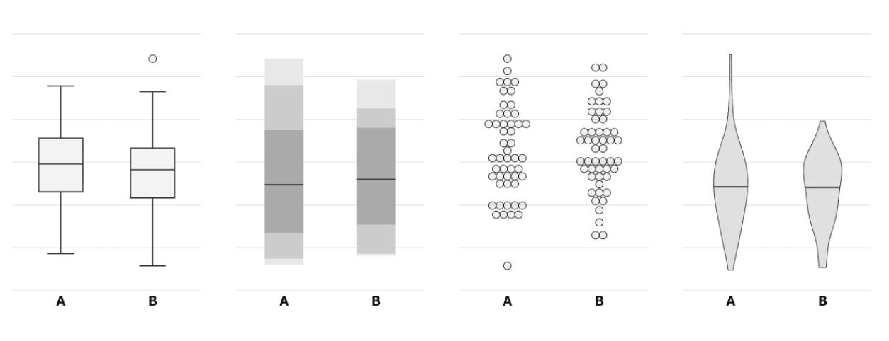

# Web app for a visual perception study

The app shows pairs of univariate charts and asks participants to assess whether they are from different sources.

Try it in test mode at [xangregg.github.io/pairstudy121](https://xangregg.github.io/pairstudy121/?group=gh1) 

