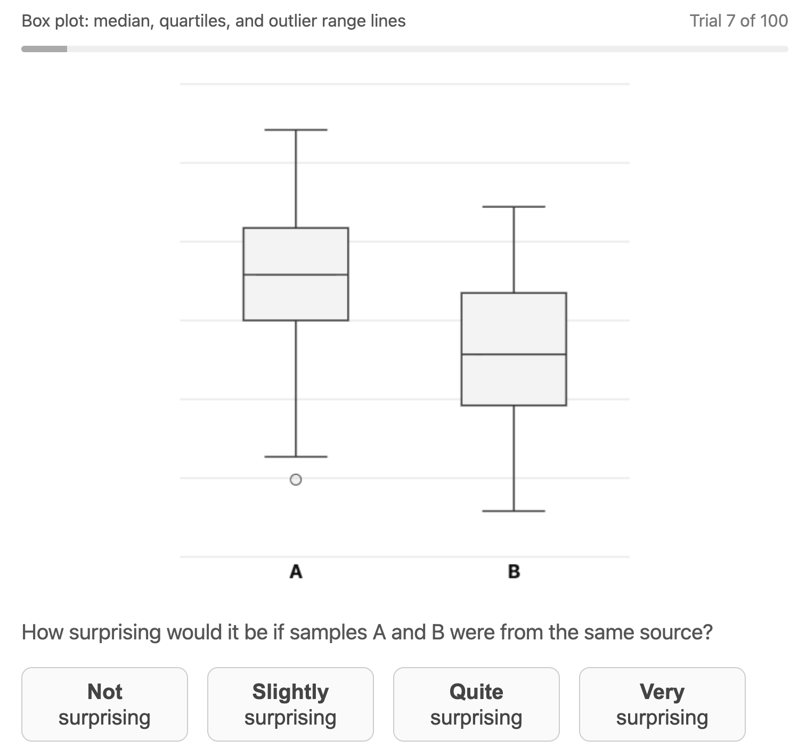
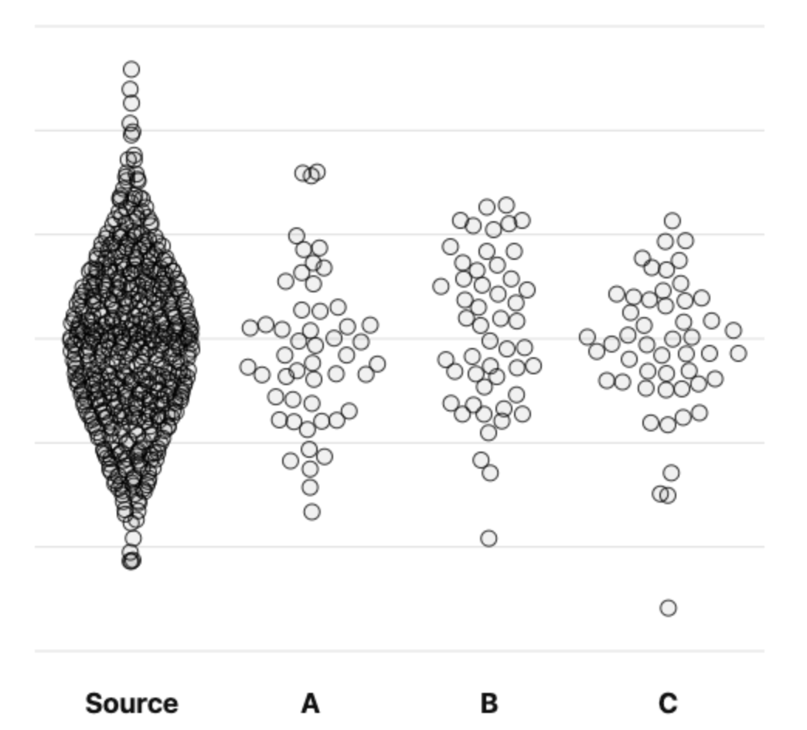

# Study Design: Paired Distributions Perception Study

## Overview

This is an online graphical perception study examining how well different statistical chart types allow observers to detect distributional differences between two groups. Each participant views a series of paired charts and rates how surprising it would be if both samples came from the same source.

Author: Xan Gregg using Claude Code

---

## Research Questions

- How do different chart types compare in their ability to convey distributional differences between groups:
  - overall?
  - for each specific signal type?
- For each chart type and signal type, how does the rating relate to the signal magnitude? Especially, is there a limit of perceptibility for each combination?
- Do overlaid dots help or hinder perception of differences?
- Do box plots detect bimodality as well as violin plots?
- Without any hinting about outliers, will participants ignore them?

There are interesting questions for almost any combination of factors.

---

## Study Factors

Each trial presents a single canvas containing two statistical charts of the same type side by side (labeled A and B). Each chart represents 50 data values sampled from a specified distribution. In trials with a non-null signal, one group has an introduced difference in location, spread, or shape; in null trials both groups are drawn from the same base distribution.

<figure style="text-align: center">
    
    <figcaption>Example trial showing a box plot pair</figcaption>
</figure>

### Chart Types

Four chart type categories are included. Each participant is randomly assigned one variant from each category; the assigned variant is fixed for the entire session.

| Category | Variant | Description                                                                                                                                                                                 |
|----------|---------|---------------------------------------------------------------------------------------------------------------------------------------------------------------------------------------------|
| Box | Box plot | Middle 50% shown as a rectangle with a median line. Whiskers extend to values within 1.5× the IQR; more extreme values shown as outlier dots.                                               |
| Box | Box plot with dots | Same as box plot, with all individual data values overlaid as dots.                                                                                                                         |
| Box | Range bar | Middle 50% shown as a rectangle with a wide median line. Thin lines extend to the full data range (no outlier trimming).                                                                    |
| Bands | Central bands (66%, 90%, 99%) with median | Nested quantile bands: darkest contains middle 66% of values, next 90%, outer 99%. Median line shown. Outliers are not shown.                                                               |
| Bands | Density bands (50%, 90%, 99%) with mode | HDR bands: darkest contains densest 50% of values, next 90%, outer 99%. Mode line shown; values outside the 99% band shown as dots. Bands may be disconnected for multimodal distributions. |
| Bands | Density bands (5%, 50%, 90%) | HDR bands: darkest contains densest 5%, next 50%, outer 90%. Values outside the 90% band shown as dots. Bands may be disconnected.                                                          |
| Bands | Density bands (33%, 67%, 100%) | HDR bands: darkest contains densest 33%, next 67%, outer band covers all remaining values. Bands may be disconnected.                                                                       |
| Dot | Dot plot | Each dot represents one data value; dots are spread horizontally to reduce overlap (according to jitter factor).                                                                            |
| Dot | Dot plot with median | Same as dot plot, with a horizontal line marking the median.                                                                                                                                |
| Violin | Violin plot | Smooth symmetric outline traces the distribution shape; width encodes local density.                                                                                                        |
| Violin | Violin plot with box | Violin outline with a box plot overlaid inside showing the median and middle 50% range.                                                                                                     |
| Violin | Violin plot with dots | Violin outline with individual data values overlaid as dots within the shape.                                                                                                               |
| Violin | Violin plot with median | Violin outline with a line marking the median.                                                                                                                                              |

All four chart type categories appear for every participant (within-subjects); which specific variant is shown within each category is randomly assigned (between-subjects).

### Jitter Types

Jitter controls how dots are spread horizontally (assuming vertical charts of ease of this description) to reduce overlap. One jitter method is randomly assigned per participant and applied consistently to all dot-based chart types (including box or violin plots with overlaid dots).

| Jitter | Description                                                                                                                                             |
|--------|---------------------------------------------------------------------------------------------------------------------------------------------------------|
| Random | Each dot is placed at a uniform random horizontal offset within a fixed half-width, with a small number of candidate positions tried to reduce overlap. |
| Wilkinson | Dots at similar values are binned by proximity, then stacked symmetrically within each bin. Not precisely Wilkinson's algorithm,                        |
| Beeswarm | Dots are placed one at a time, in ascending value order, at the horizontal position closest to center that does not overlap any already-placed dot.     |
| Density random | Like random, but the horizontal range available to each dot scales with the local KDE density, keeping dots within the violin shape.                    |

### Data Distributions

The survey app supports up to three base distributions to generate the raw data for each trial. However, for the current study, only the normal distribution is used.

| Distribution | Proportion of trials | Notes |
|---|------------------|---|
| Normal (Gaussian) | 100% (100/100)   | Standard parameterization |
| Lognormal | 0% (0/100)       | Right-skewed; rendered on normalized scale |
| Binomial | 0% (0/100)       | n = 10, p = 0.2 base; normalized to ~N(0,1) scale |

### Signals

A *signal* is a modification applied to one of the two groups to create a potentially detectable difference. Each trial draws one signal from the applicable distribution's signal pool using weighted random sampling. The null signal (no modification) is included in each pool. Signals with weight 0 are defined but excluded from sampling.

Each signal has a *level* (null / weak / moderate / strong) used for alignment scoring on the completion page.

**Normal distribution — 15 active signal types (weight > 0):**

| Signal type | Parameters | Level | Weight |
|---|---|---|---|
| Null | — | null | 12 |
| Location shift | Δ = 0.5 SD | weak | 5 |
| Location shift | Δ = 0.8 SD | moderate | 10 |
| Location shift | Δ = 1.1 SD | strong | 10 |
| Location shift | Δ = 1.4 SD | strong | 5 |
| Spread change | Factor = 1.2× | weak | 5 |
| Spread change | Factor = 1.5× | moderate | 10 |
| Spread change | Factor = 1.8× | strong | 5 |
| Skew | Skew-normal α = 5; mean-centered (µ=0), SD ≈ 0.62 | moderate | 5 |
| Skew | Skew-normal α = 7; mean-centered (µ=0), SD ≈ 0.51 | strong | 5 |
| Bimodal | Separation = 2.0 SD | weak | 8 |
| Bimodal | Separation = 3.0 SD | moderate | 8 |
| Bimodal | Separation = 4.0 SD | strong | 8 |
| Bimodal | Separation = 5.0 SD | strong | 2 |
| Outlier | 1 high value at 4.0 SD magnitude | weak | 5 |

**Lognormal distribution — 10 signal types:**

| Signal type | Parameters |
|---|---|
| Null | — |
| Location | Ratio = 1.2, 1.3, 1.4, 1.5, 1.6 (5 levels) |
| Spread | Factor = 1.2×, 1.4×, 1.6×, 1.8× (4 levels) |

**Binomial distribution — 5 signal types:**

| Signal type | Parameters |
|---|---|
| Null | — |
| Parameter change | (n=10, p=0.1), (n=10, p=0.3), (n=10, p=0.4), (n=5, p=0.2) |

### Signal Assignment

Signals are assigned using weighted random sampling. A pool of exactly 100 signal instances is constructed via the largest-remainder method applied to each signal's weight, then shuffled. This guarantees the total count per signal type is proportional to its weight, with each signal appearing either ⌊100 × w/W⌋ or ⌈100 × w/W⌉ times (where W = sum of all active weights = 103 for normal). Approximate expected counts for the normal distribution:

| Signal type | Expected trials |
|---|---|
| Null | ~12 |
| Location (all levels) | ~29 |
| Spread (all levels) | ~19 |
| Skew (all levels) | ~10 |
| Bimodal (all levels) | ~25 |
| Outlier | ~5 |

Signals are **not balanced within chart type**: a given signal may pair with one chart type more than another within a session, though this averages out across participants.

### Signal Group

"Signal group" indicates which of the two displayed groups (A or B) receives the signal. Exactly 50 of each participant's 100 trials assign the signal to group A; 50 assign it to group B. This balance is enforced globally across all 100 trials via a shuffled binary assignment vector. Balance within chart type or distribution subsets is not explicitly enforced but is expected to be approximately 50/50 given 25 trials per chart type.

### Participant Background

Before the main study begins, participants complete a brief self-report questionnaire collected as potential covariates for analysis.

**Familiarity** (Unfamiliar / Somewhat / Very familiar):
- Bar charts
- Scatter plots
- Box plots
- Mean
- Standard deviation
- Median
- Quartile
- Linear regression

### Training

All participants complete the same onboarding sequence before their first trial. The sequence is not adaptive and cannot be skipped. Steps proceed in this order:

1. **Background questionnaire** — the familiarity and frequency questions above. The Continue button is disabled until all questions are answered.
2. **Understanding Sampling (3 pages)** — introduces the concept that each chart shows a random sample from a larger source. Page 1 shows one source and one sample; page 2 shows one source and three samples to illustrate within-source variation; page 3 shows two sources with one sample each to illustrate between-source differences.
3. **Chart Types** — an overview page showing thumbnail examples of all four assigned chart types, followed by one dedicated page per chart type explaining how to read it, with an example pair drawn from the same source. The training is only for the variants of the chart type that the participant will see in the study.
4. **Response scale** — explains the 4-point rating scale and its intended meaning.

<figure style="text-align: center">
    
    <figcaption>Second sampling training page.</figcaption>                
</figure>   
The chart-type training pages are ordered to match the sequence in which each chart type first appears in that participant's randomized trial list. Additionally, each trial page shows a brief summary of the chart type details, such as specific cut-offs in use for band charts.

---

## Response Variable

The trial question is: *"How surprising would it be if samples A and B were from the same source?"*

Participants respond on a 4-point ordinal scale:

| Score | Label | Operational meaning shown to participants |
|-------|-------|------------------------------------------|
| 1 | Not surprising | The difference looks like normal sampling variation — what you'd expect even if A and B come from the same source. |
| 2 | Slightly surprising | The difference is a little more than typical, but could still easily be due to random sampling. |
| 3 | Quite surprising | The difference seems more than you'd usually expect from random sampling alone. |
| 4 | Very surprising | The difference would be very unusual if A and B were random samples from the same source. |

Response buttons are suppressed for 500 ms after each trial begins to reduce accidental and impulsive responses. Additionally, the button's hover highlight is disabled until the mouse is moved to reduce anchoring bias.

In addition to the response and design factors, key summary statistics for each trial are also recorded. Though the entire trial data sets can be recovered from the seed, these measures are a convenience for analysis and reporting purposes. An analysis may prefer to use, for instance, the actual mean difference rather than the signal magnitude.

---

## Design Structure

### Between-Subjects Factors
Each participant is assigned a random combination of the following factors. The idea is to reduce training and ambiguity (some variants have similar appearances but different meanings).

| Factor | Levels | Notes |
|--------|--------|-------|
| Chart variant | 1 per category, randomly assigned | Specific rendering option within each chart type category |
| Display orientation | Vertical, Horizontal | Axis orientation is transposed between conditions |
| Jitter method | Random, Wilkinson, Beeswarm, Density-random | Applies to dot plot rendering only |

### Within-Subjects Factors

Each participant completes 100 trials presented in randomized order.

| Factor | Levels | Trials per level          |
|--------|--------|---------------------------|
| Chart type | 4 | 25 each                   |
| Distribution | Normal, Lognormal, Binomial | 100, 0, 0                 |
| Signal type | 15 active (19 defined) | Random assignment per trial |
| Signal magnitude | Continuous / ordinal within type | Nested within signal type |
| Signal group | A or B | 50 each (globally balanced) |

Distribution and chart type are crossed within each participant: each combination of chart type × distribution appears with trial counts proportional to the distribution weights (normal: 25 trials per chart type; lognormal and binomial: 0 each).

---

## Randomization

All randomization uses the mulberry32 pseudo-random number generator (32-bit LFSR). Each participant receives a random seed at first visit. All aspects of the design — chart type and variant assignments, orientation, jitter, trial order, signal draws, signalGroup assignments — are derived deterministically from that seed, ensuring full reproducibility from the participant seed alone.

Data generation uses a fixed pool of 100 algorithmically screened seeds (DATA_SEEDS) that are shuffled separately per distribution and assigned to trials without replacement within a participant. With 100 seeds and at most 100 normal trials per participant, each base dataset appears at most once per participant.

Seeds are selected by scanning integer multiples of 100,000 (starting at 10,100,000) and retaining those that pass two null-balance checks applied independently for both the normal and lognormal, if in use, distributions:

1. **Extremes check:** the difference between groups A and B in their maximum values, and separately in their minimum values, must each be less than a threshold fraction of the combined range (0.30 for normal, 0.40 for lognormal). This screens out seeds where one group's tail placement is deceptively extreme relative to the other.
2. **Mean check (Cohen's d):** the standardized mean difference between groups A and B must satisfy |d| < 0.25, where d is computed using the pooled sample standard deviation. This threshold is distribution-agnostic and corresponds approximately to a Welch's t-statistic of 1.25 (two-tailed p ≈ 0.21). Seeds with a larger mean difference would look deceptively shifted under a null signal.

These criteria ensure that null-signal trials show no systematic group difference beyond natural random-sampling variation.

---

## Data Quality

Participants will be filtered based on attention checks to be determined after the pilot run, Basic ideas
1. require reasonable responses for null and strong signals on average
2. check some response patterns (repeats and sawtooths)
3. check response times for rapid clicking

---

## Analysis Plans

Not sure if response needs to be ordinal or treated linear (which I believe is common treatment for Likert scales).

General plan is to collect enough samples so that between subjects effects will balance out but to also try a full factor random effects model.

Hoping to clarify after pilot runs. During pilot runs, signal magnitudes can be adjusted.

**Primary comparison:** Response versus signal magnitude by various factors, especially chart type.

---

## Hypotheses

### Hot Takes
1. Bimodal signals are detected at lower magnitudes with box plots than with violin plots.
1. Adding dots to violin and box plots decrease response quality.
1. Beeswarm jitter performs worse than the others.
1. Though least familiar, the bands charts are no worse than the others.

### Cold Takes
1. Chart orientation doesn't affect response quality.
1. Skew is the hardest strong signal to detect.
1. Range Bar makes the mild outlier signal look strongish.

---

## Design Limitations

1. **Each participant only sees a small number of chart types.** That makes it harder to analyze chart effects since it's between-participant, but it makes the training simpler (each participant only has to learn one variant of each of the four chart types), which hopefully makes the response quality better, and it's consistent with real world chart usage by an analyst.
1. **Same for jitter types**
1. **Anchoring could be a problem** That is, where one response is biased by the previous response. Either a tendency to rate the same, or a relative rating. The usual fixes seem worse: re-arranging response buttons, required pauses between questions, ...

---

## Open Questions

1. How to frame the main question and with what response scale? The survey aims to explore the basic EDA question: "Is this anything?" The framing can be switched via the `QUESTION_FRAMING` constant in `question.js` between `"surprise"` (current) and `"evidence"`. **Status quo**: framed as how surprising it would be if both samples came from the same source.
2. How many response scale items? The main feature of the question is that it's asymmetric. In the spirit of the null hypothesis, there is only evidence for a difference, not evidence for similarity. **Status quo**: 4 levels: not/slightly/quite/very surprising.

