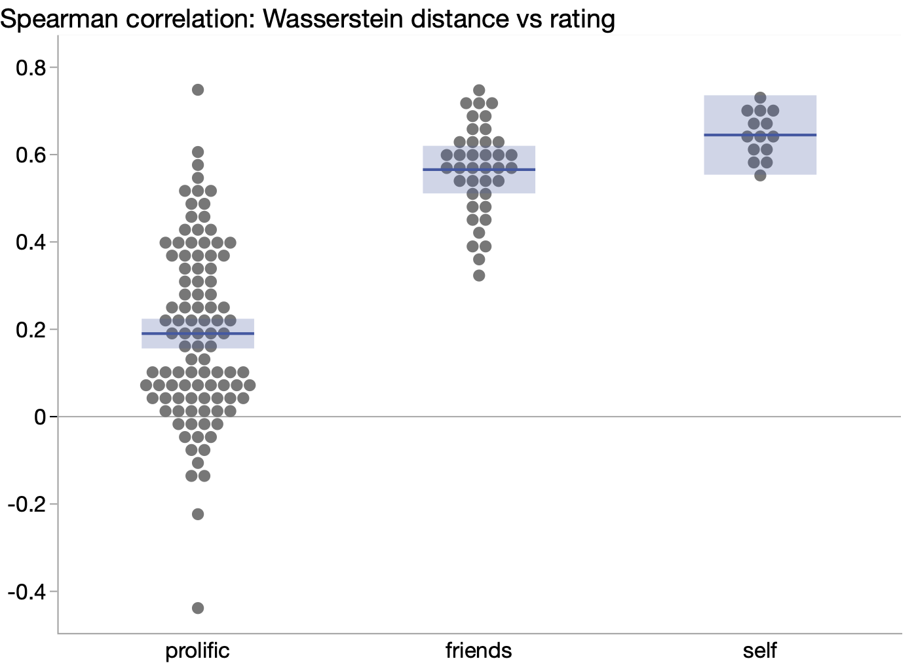
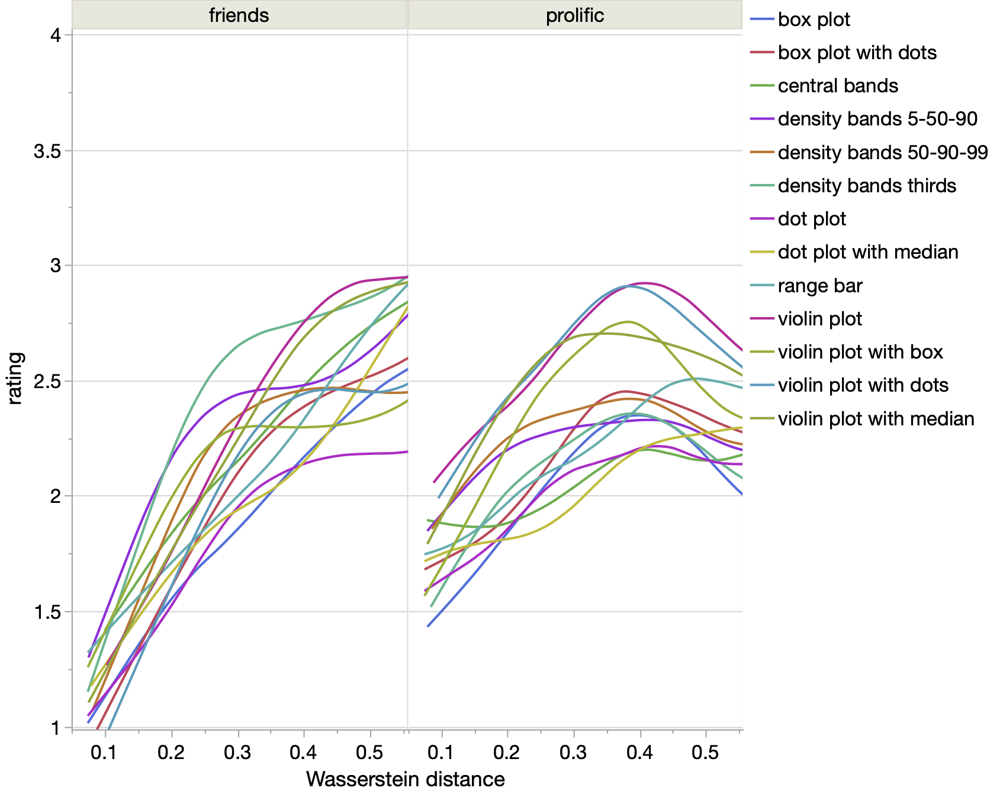
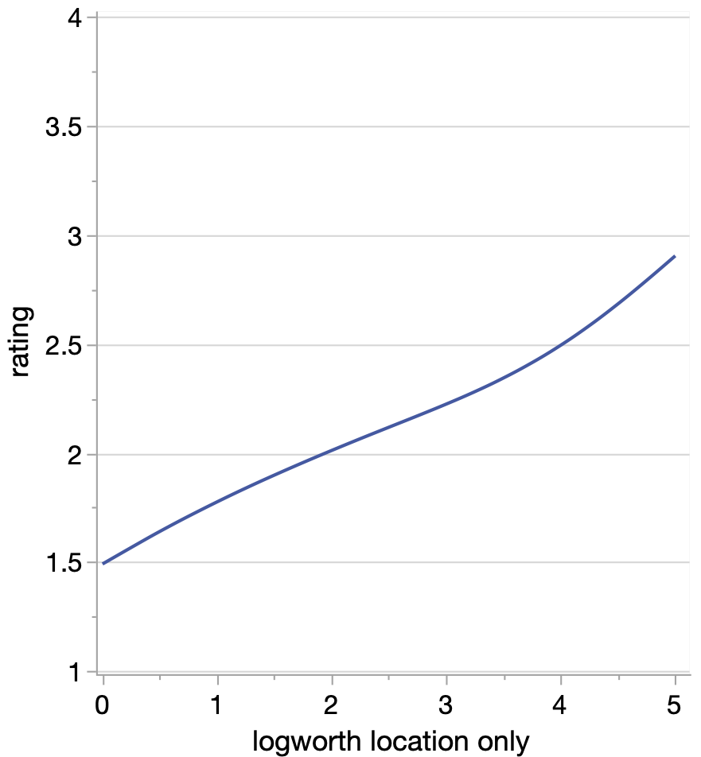

This directory contains the results of "round 1" of the paired charts study
consisting of 39 social media volunteers (Bluesky, Mastodon, local)
called "friends" in the data files and
100 paid participants from Prolific, plus 14 self test runs.
codebook.md describes the content of the two data files.

This phase was run in pilot mode with no specific analysis plan
or quality expectations. The main needs discovered in this
phase were:
* how to measure the "expected" surprise that the two charts come from different sources
* how to measure the quality of respondents

See the [blog post](https://rawdatastudies.com/2026/04/19/visualization-study-web-app/)
for discussion of the survey overall.

### Computing Surprise

My original plan was to use the signals used to create the data.
Each pair of chart samples starts as random normal data
and one of them has a "signal" applied, namely a change of
location, spread, bimodalness or skewness.
However, the amount of natural random variation could
sometimes bury the signal and other times create its own signal.
Plus, the signals are on different scales.

For those reasons, I started looking for a statistical
measure of difference to be treated as the expected surprise,
with two main approaches.

#### P-values

I computed p-values for means difference, variance difference, and non-normality.
And p-values can be converted to logworth to approximate the surprise scale.
Seems clean, but there are still three separate values with no easy way
to combine them and non-normality covers a lot of ground. Logworth
would be more appealing if a future survey only used one signal type.

#### Distribution difference

I computed many measures of distribution difference.
They don't seem to capture differences as reliably as p-values,
but they do each provide a single measure for any pair. All
were pretty closely correlated, and I included two of them in
the trials.csv file: Kolmogorov-Smirnov Distance and
Wasserstein Distance.

### Participant quality

It wasn't a surprise but still a disappointment that the Prolific
users had lower quality responses. Hard to say the main source:
* intentional lack of engagement (definitely a couple speed runners)
* topic too esoteric for general audience (I did filter on college education (self-reported I assume))
* not enough training up-front

The most promising quality filter is the correlation between the ratings
and the distance measures for each pair of a each participant. Here's
the correlation coefficient for each participant broken down by group.

So it looks like I'd need to cut out 1/2 to 2/3 of the Prolific
users or find a better way to filter them up front.

### Things that haven't mattered

#### Background questionnaire

The study begins with a questionnaire of familiarity with eight
statistical concepts from bar charts to linear regression.
None had any effect on the quality metric. Possibly the scale
was too vague or coarse (3 levels of familiarity), or
possibly there was a language barrier for statistical concepts.
I'll likely drop the questionnaire in future rounds
since it could detract from the trials engagement level.

#### Orientation

I went to some effort in the original version of
the study to support both horizontal and vertical
orientations of the charts. However, I saw no difference
from early trials and switched to just vertical orientation
before the Prolific round.

#### Dark mode

I didn't make it a randomized factor, but the survey software
should honor dark mode, and I can get an indication of the
settings from the captured browser data.

#### Jitter style

I assign one of four jitter methods to each participant.
So far I haven't seen any difference, but I may still keep
it as a randomized factor for another round, at least,
out of personal interest.

#### Chart type

Comparing chart types was the main goal of the study,
but so far there are too many chart types present
for the amount of quality data. No difference would
still be an interesting outcome of the study, but
I'll keep trying to improve the signal to noise ratio,
either with more trials or fewer chart types.

### Good news

At least the slope of the curves is strong for the friends group
(and for the quality-filtered Prolific group). Ideally, it
would shoot up closer to 4, but at least it starts strong.

And it's probably not a new finding, but using the p-values
we can estimate how p-values correspond to the observed
difference in whole sample visualization (rather than
visualizing the mean directly that is). The next graph shows
the location difference logworth (logworth of 2 is a p-value of 0.01)
filtered by trials from quality participants and where the
spread and nonnormality p-values were > 0.1.

From this data, two samples with a means difference p-value of 0.01
only rate a "slightly surprising" rating. Related paper:
S. Zhang, P.R. Heck, M.N. Meyer, C.F. Chabris, D.G. Goldstein, & J.M. Hofman, An illusion of predictability in scientific results: Even experts confuse inferential uncertainty and outcome variability, Proc. Natl. Acad. Sci. U.S.A. 120 (33) e2302491120, https://doi.org/10.1073/pnas.2302491120 (2023).
